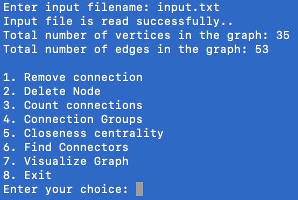
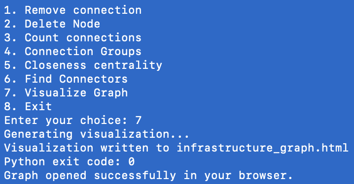

# Infrastructure Network Analyzer

A console application that builds an undirected, unweighted network graph from a tab-separated input file and provides analytics like connection counts, node groups by attribute, closeness centrality, and connector nodes.

## Demo

1. **Initial Load and Menu:**

	

2. **Graph Ready State:**

	

# Infrastructure Network Analyzer

Infrastructure Network Analyzer is a graph-based Java project that loads a tab-separated dataset and analyzes relationships between connected nodes. The current version supports network construction, connection counting, group-based exploration, closeness centrality, and connector node detection, making it a strong foundation for graph analytics and systems-style problem solving. :contentReference[oaicite:1]{index=1}

## Current Features

- Builds an undirected, unweighted graph from TSV input
- Counts and displays node connections
- Groups nodes by shared attributes
- Computes closeness centrality
- Detects connector nodes and articulation points
- Includes a Python visualization helper script alongside the Java analyzer files :contentReference[oaicite:2]{index=2}

## Tech Stack

- Java
- Python for visualization support
- TSV input pipeline :contentReference[oaicite:3]{index=3}

## Future Plans

This project is a candidate for a future C++ rewrite focused on performance, memory control, and lower-level graph system design. The goal would be to evolve it from a class-style Java analyzer into a more advanced systems-oriented graph toolkit.

Planned future directions:
- Rebuild the core graph engine in C++
- Replace basic structures with custom adjacency-list and traversal implementations
- Add weighted graphs and shortest path algorithms such as Dijkstra
- Add graph statistics dashboards and richer visual output
- Support larger datasets and benchmark runtime and memory usage
- Add export formats for reports and graph snapshots
- Build an interactive CLI or lightweight GUI for exploration
- Compare Java and C++ versions for speed, scalability, and design tradeoffs

## Why This Project Matters

This project is useful for demonstrating graph fundamentals, algorithmic thinking, and data structure design. As it grows, it can also become a strong portfolio piece for C++, systems, infrastructure, or backend-focused roles.

## Files
- [Network_Analyzer.java](Network_Analyzer.java): Main program and graph implementation.
- [input.txt](input.txt): Example input data file (TSV).

## Requirements
- Java JDK (11+ recommended).

## Build and Run
- Compile:

```bash
cd /workspaces/Network_Analyzer
javac Network_Analyzer.java
```

- Run:

```bash
java Network_Analyzer
```

When prompted, enter the path to your TSV input file (for example, `input.txt`).

## Input Format (TSV)
- Header line followed by one line per node.
- Columns:
	1. `id` (long)
	2. `name1`
	3. `name2`
	4. `group` (e.g., college)
	5. `type` (e.g., department)
	6. `email`
	7. `connectionCount` (int)
	8. `connectionID1` ... `connectionIDN` (exactly `connectionCount` ids)

```
id	name1	name2	group	type	email	connectionCount	connectionID1	connectionId2
1	Alpha	NodeA	"Engineering"	ECE	alpha@network.com	2	2	3
2	Beta	NodeB	"Engineering"	ME	beta@network.com	1	1
```

```
3	Gamma	NodeC	"Arts & Sciences"	Math	gamma@network.com	1	1
```

Notes:
 - Ensure `connectionCount` matches the number of following IDs on the line.
- `group` values may be quoted in the input; quotes are handled.
- Connections are treated as undirected and added only once.

## Features
- Remove connection: deletes an undirected edge between two nodes.
- Delete node: removes a node and all incident connections.
- Count connections: shows count and lists direct neighbors.
- Node group: lists connected groups filtered by `group`.
- Closeness centrality: computes and shows raw and normalized scores.
- Find connectors: identifies articulation points in the graph.

## Usage Tips
- Keep node ids unique across the file.
- Ensure `connectionCount` matches the number of following connection ids on the line.
- Use the menu to perform operations after the file loads.
